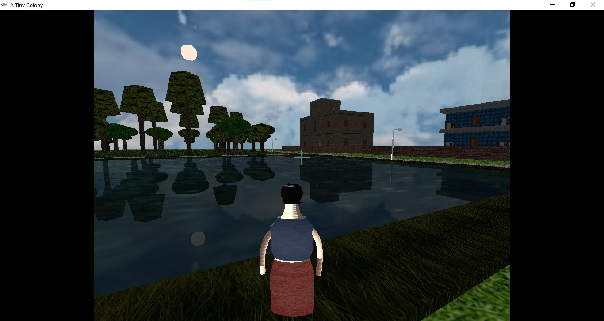

# A-tiny-colony
A Computer Graphics project using C++ and OpenGL. The colony has a residential building, a school, a pond and some trees. Besides that, an explorable environment is added. An agent is deployed in the environment to be controlled by the user. The agent can roam free in the environment, climb stairs or may jump from buildings if told so.

### Controls
The agent can be controlled by the keyboard. The keys **wasd** controls where the agents looking at and the keys **ijkl** controls the movement of the agent. The agent cant pass through objects, but it can get over small objects like staircases. Pressing down the key **c** enables the agent to get over relatively large objects like fences. The key **D** toggles drone mode on-off. While in drone mode the agent can fly. The keys **+-** can be used to move up or down. The user can adjust the movement speed at their will by using the keys **QS**. The additional and occassionally useful controls can be found in the console after running the program.

### Editor mode
In editor mode users can create and save their own curved objects. To enable editor mode the user have to press **e** and to start/restart and stop selecting control points for the curved surfaces the user have to press **p** (the control points refer to the control points of a Bezier curve). The key **P** can be used to save the current coordinates to a text file (the file name has to be entered on the console). 

### Demo video
A demonstration video can be found here: https://youtu.be/jOGV6wVyTbg

# Requirements
+ Windows 7 or higher
+ glut version 3.7.6 or higher

Instruction for setup can be found [here](https://www.codewithc.com/how-to-setup-opengl-glut-in-codeblocks).

# Some Screenshots
A birds eye view of the total space.

Third person view enabled on initial view.

Beside the forest at night.

The setting sun and it's reflection on the pond water.

Yet another reflection at dawn.

