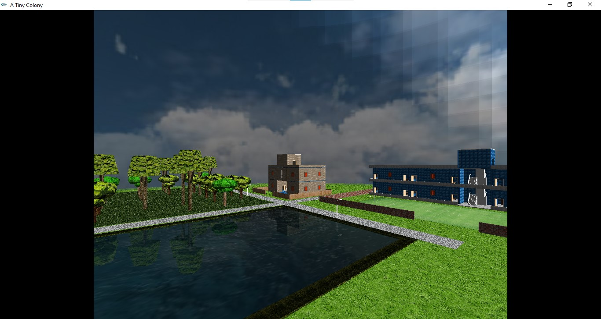
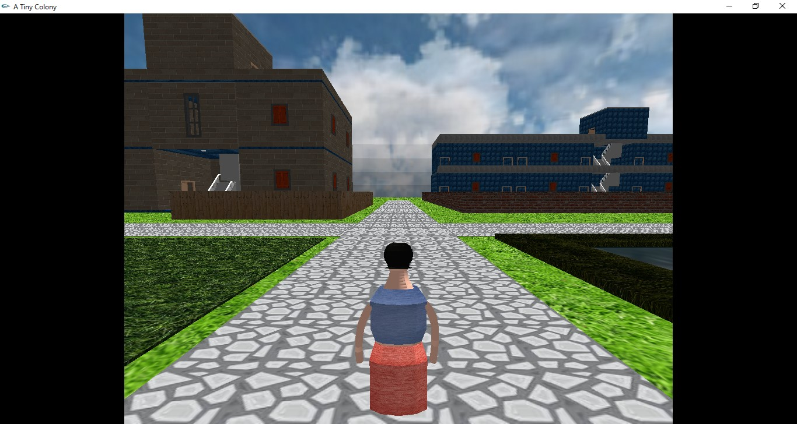
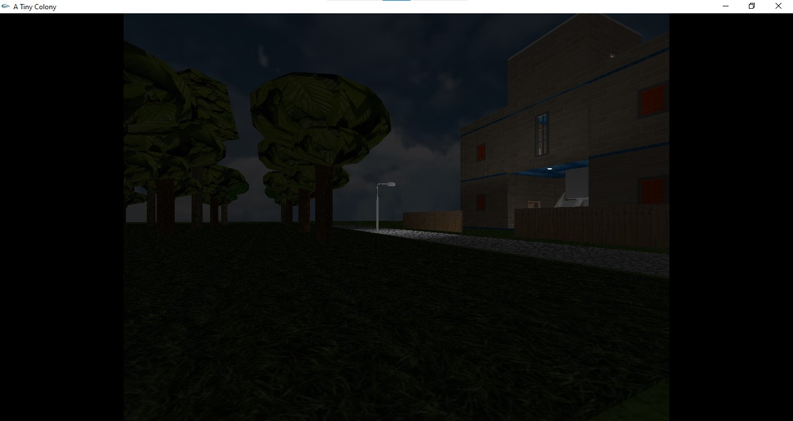
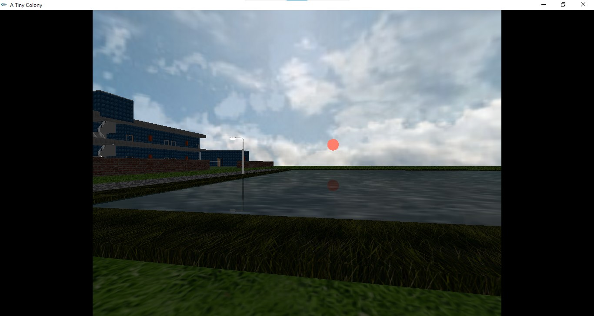

# A-tiny-colony
A Computer Graphics project using C++ and OpenGL. The colony has a residential building, a school, a pond and some trees. Besides that, an explorable environment is added. An agent is deployed in the environment to be controlled by the user.

# Requirements
+ glut version 3.7.6 or up

# Some Screenshots
A birds eye view of the total space.

Third person view enabled on initial view.

Beside the forest at night.

The setting sun and it's reflection on the pond water.
